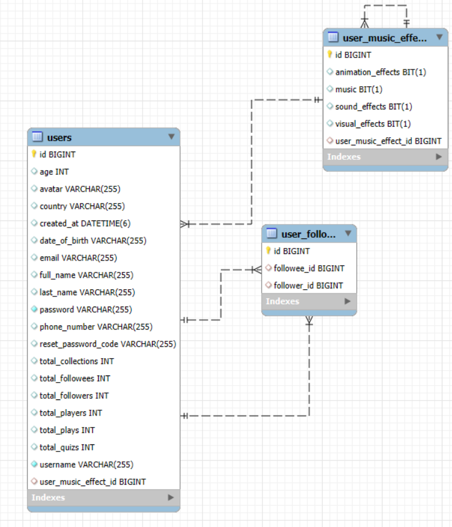
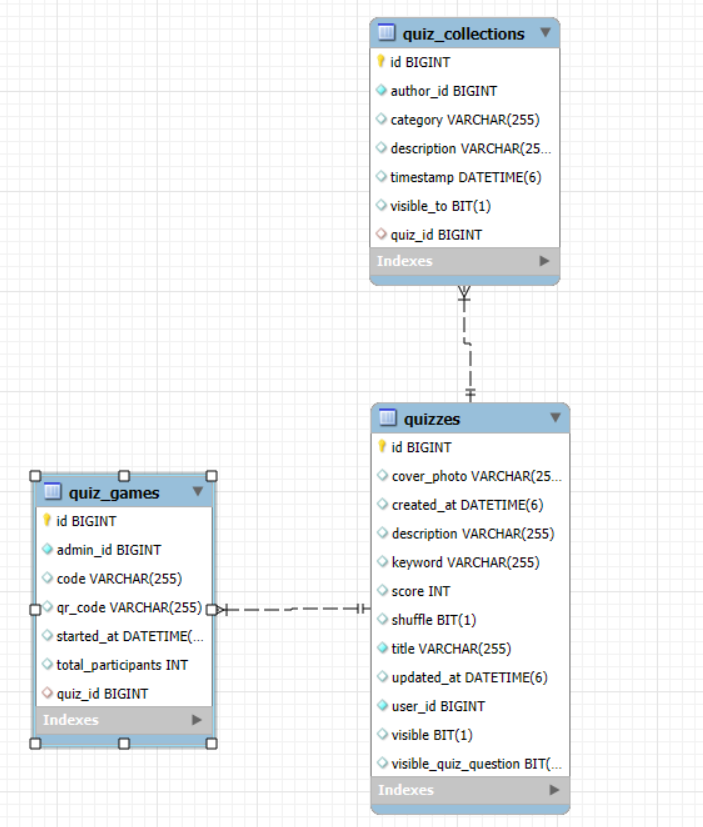
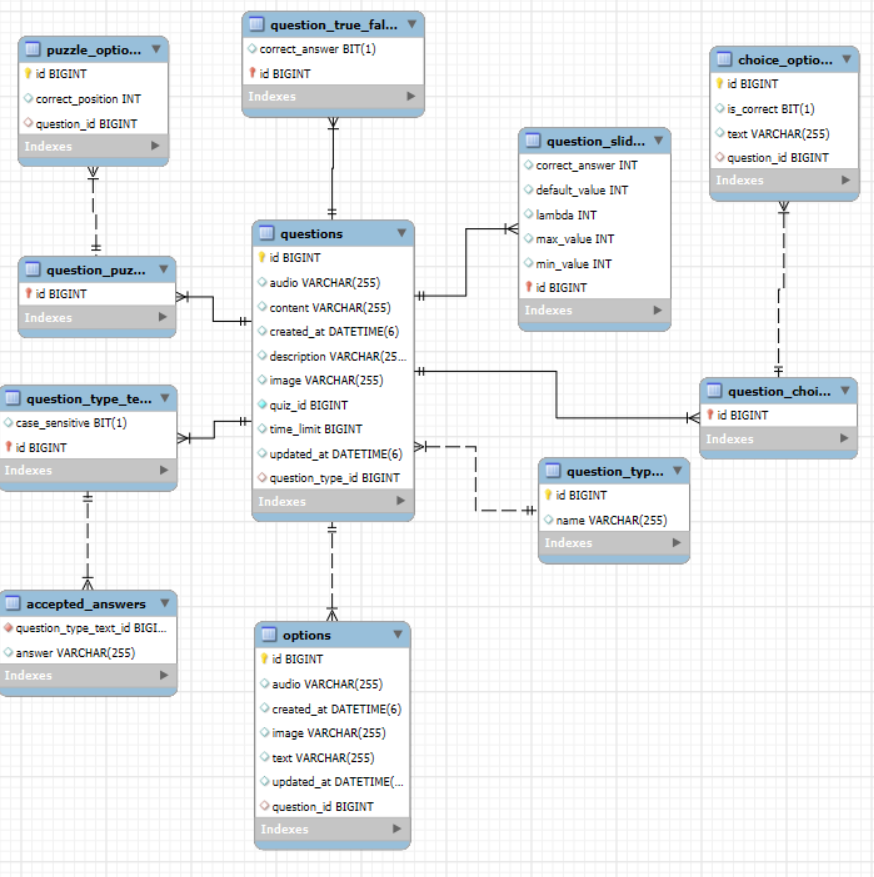
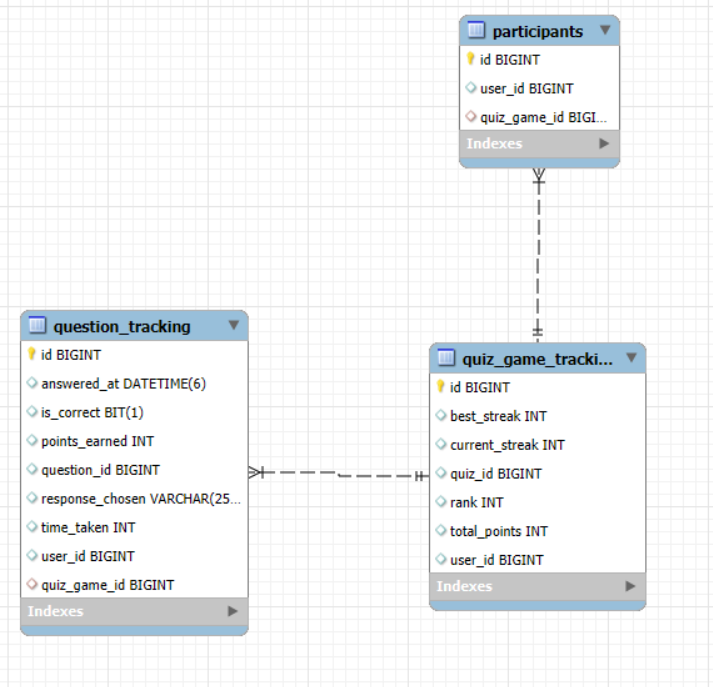

# 📊 Ứng Dụng Quiz Microservices - Phân Tích và Thiết Kế

Tài liệu này phác thảo quá trình **phân tích** và **thiết kế** cho hệ thống Ứng Dụng Quiz dựa trên kiến trúc microservices. Nó giải thích các quyết định về kiến trúc và các thành phần hệ thống.

---

## 1. 🎯 Phát Biểu Vấn Đề

Ứng Dụng Quiz là một nền tảng tương tác được thiết kế để tạo, quản lý, và tham gia vào các trò chơi câu đố.

- **Đối tượng người dùng là ai?**
  - Học sinh muốn kiểm tra kiến thức của họ
  - Giáo viên/nhà giáo dục tạo nội dung quiz
  - Quản trị viên quản lý nền tảng
  - Người dùng thông thường chơi trò chơi câu đố để giải trí

- **Mục tiêu chính là gì?**
  - Cho phép người dùng tạo và tùy chỉnh các bài quiz với nhiều loại câu hỏi khác nhau
  - Cung cấp trải nghiệm chơi quiz tương tác theo thời gian thực
  - Theo dõi hiệu suất và tiến trình của người dùng
  - Hỗ trợ các định dạng quiz và loại câu hỏi khác nhau
  - Đảm bảo khả năng mở rộng và độ tin cậy của nền tảng

- **Loại dữ liệu nào được xử lý?**
  - Thông tin tài khoản người dùng và hồ sơ
  - Nội dung quiz bao gồm câu hỏi và câu trả lời
  - Thống kê gameplay và dữ liệu hiệu suất người dùng
  - Các mối quan hệ người dùng (theo dõi, chia sẻ)

---

## 2. 🧩 Các Microservices Đã Xác Định

| Tên Dịch Vụ      | Trách Nhiệm                                               | Stack Công Nghệ        |
|------------------|----------------------------------------------------------|----------------------|
| User Service      | Quản lý hồ sơ người dùng, mối quan hệ và tùy chọn        | Spring Boot, MySQL    |
| Quiz Service      | Xử lý việc tạo quiz, bộ sưu tập và metadata             | Spring Boot, MySQL    |
| Question Service  | Quản lý các loại câu hỏi khác nhau và nội dung của chúng | Spring Boot, MySQL    |
| Gameplay Service  | Theo dõi phiên chơi quiz, người tham gia và kết quả      | Spring Boot, MySQL    |
| Identity Service  | Xử lý xác thực, ủy quyền và bảo mật                      | Spring Boot, JWT      |
| Eureka Server     | Khám phá và đăng ký dịch vụ                              | Spring Cloud Netflix  |
| API Gateway       | Định tuyến yêu cầu và đóng vai trò như điểm vào hệ thống | Spring Cloud Gateway  |

---

## 3. 🗂️ Thiết Kế Dữ Liệu

Mỗi dịch vụ duy trì cơ sở dữ liệu riêng để đảm bảo kết nối lỏng lẻo:

- **Cơ Sở Dữ Liệu User Service**:
  - `users`: Thông tin người dùng cốt lõi
  - `user_profiles`: Thông tin hồ sơ mở rộng
  - `user_follows`: Dữ liệu mối quan hệ người dùng
  - `user_settings`: Tùy chọn và cài đặt người dùng
  - `user_music_effects`: Tùy chọn âm thanh của người dùng

  

- **Cơ Sở Dữ Liệu Quiz Service**:
  - `quizzes`: Metadata quiz cốt lõi
  - `quiz_collections`: Nhóm các quiz liên quan
  - `quiz_games`: Metadata phiên chơi trực tiếp
  - `quiz_tags`: Thẻ phân loại
  - `quiz_categories`: Các danh mục quiz chính

  ](./assets/quiz_db.png)

- **Cơ Sở Dữ Liệu Question Service**:
  - `questions`: Thực thể câu hỏi cơ sở
  - `question_types`: Các định dạng khác nhau (TRUE_FALSE, CHOICE, SLIDER, v.v.)
  - Các bảng dành riêng cho từng loại:
    - `question_true_false`: Câu hỏi Boolean
    - `question_choice`: Câu hỏi trắc nghiệm
    - `question_slider`: Câu hỏi phạm vi số
    - `question_puzzle`: Câu hỏi dạng câu đố
    - `question_text`: Câu hỏi phản hồi văn bản tự do

  ](./assets/question_db.png)

- **Cơ Sở Dữ Liệu Gameplay Service**:
  - `quiz_game_tracking`: Tiến trình và thống kê phiên
  - `participants`: Người dùng tham gia vào phiên chơi
  - `question_tracking`: Hồ sơ các phản hồi của người dùng đối với câu hỏi
  - `game_results`: Dữ liệu kết quả cuối cùng
  - `game_analytics`: Số liệu hiệu suất

  ](./assets/gameplay_db.png)

---

## 4. 🔐 Cân Nhắc Bảo Mật

- **Xác Thực Đầu Vào**:
  - Xác thực yêu cầu ở cả phía client và server
  - Mẫu DTO được sử dụng để lọc và xác thực dữ liệu đầu vào

- **Giao Tiếp An Toàn**:
  - HTTPS cho tất cả các giao tiếp API bên ngoài
  - Các cuộc gọi dịch vụ nội bộ được bảo mật trong mạng Docker

- **Xử Lý Lỗi**:
  - Trình xử lý ngoại lệ tùy chỉnh ngăn chặn việc rò rỉ thông tin nhạy cảm
  - Phản hồi lỗi được chuẩn hóa trên các dịch vụ

---

## 5. 📦 Kế Hoạch Triển Khai

- **Container hóa với Docker**:
  - Mỗi dịch vụ có Dockerfile riêng
  - Cơ sở dữ liệu MySQL được container hóa với các script khởi tạo
  - Biến môi trường cho cấu hình dịch vụ

- **Điều Phối Container**:
  - Docker Compose cho môi trường phát triển cục bộ
  - Các dịch vụ được cấu hình để khởi động theo thứ tự thích hợp với kiểm tra sức khỏe
  - Có thể mở rộng cho sản xuất sử dụng Kubernetes (tương lai)

- **Quản Lý Cấu Hình**:
  - Cấu hình bên ngoài thông qua application.properties
  - Cài đặt dành riêng cho môi trường thông qua biến môi trường Docker
  - Chỉ định cổng nhất quán qua các môi trường

## ✅ Tổng Kết

Kiến trúc microservices cho Ứng dụng Quiz cung cấp một số lợi thế:

1. **Phát Triển & Triển Khai Độc Lập**: Mỗi dịch vụ có thể được phát triển, kiểm tra và triển khai độc lập, cho phép cung cấp tính năng nhanh hơn và tự chủ cho nhóm.

2. **Khả Năng Mở Rộng**: Các dịch vụ có thể được mở rộng riêng lẻ dựa trên nhu cầu (ví dụ: Gameplay Service trong thời điểm cao điểm, Question Service cho các hoạt động nặng về nội dung).

3. **Linh Hoạt Công Nghệ**: Mặc dù hiện đang được chuẩn hóa trên Spring Boot, mỗi dịch vụ có thể tiềm năng sử dụng các công nghệ khác nhau nếu cần cho các yêu cầu cụ thể.

4. **Khả Năng Phục Hồi**: Lỗi trong một dịch vụ không làm sập toàn bộ hệ thống, và các dịch vụ có thể được thiết kế với cơ chế dự phòng.

5. **Khả Năng Bảo Trì**: Codebase nhỏ hơn, tập trung dễ hiểu và bảo trì hơn so với ứng dụng monolithic.

6. **Tối Ưu Hiệu Suất**: Tài nguyên có thể được phân bổ dựa trên nhu cầu dịch vụ cụ thể thay vì mở rộng toàn bộ ứng dụng.

Kiến trúc này hỗ trợ các yêu cầu của nền tảng quiz tương tác đồng thời cung cấp nền tảng cho sự phát triển và mở rộng tính năng trong tương lai.

## Tác Giả

- TEAM 3
