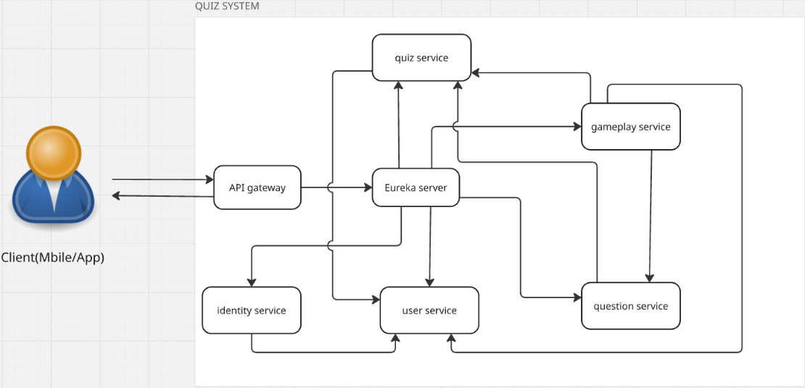

# Kiến Trúc Hệ Thống

## Tổng Quan
- **Mục Đích**: Hệ thống microservices cung cấp nền tảng quiz tương tác, cho phép người dùng tạo, quản lý và tham gia các trò chơi trắc nghiệm với nhiều loại câu hỏi khác nhau.
- **Thành Phần Chính**: Hệ thống bao gồm 7 thành phần chính: API Gateway, Eureka Server, Identity Service, User Service, Quiz Service, Question Service và Gameplay Service.

## Thành Phần Hệ Thống
- **User Service**: Quản lý thông tin người dùng, hồ sơ, cài đặt cá nhân và các mối quan hệ giữa người dùng (theo dõi, kết bạn).
- **Quiz Service**: Quản lý việc tạo và lưu trữ quiz, bộ sưu tập quiz, trò chơi quiz và metadata liên quan.
- **Question Service**: Quản lý nhiều loại câu hỏi khác nhau (đúng/sai, trắc nghiệm, thanh trượt, câu đố, văn bản) và nội dung của chúng.
- **Gameplay Service**: Theo dõi phiên chơi quiz, lưu trữ câu trả lời của người chơi, tính điểm và cung cấp phân tích kết quả.
- **Identity Service**: Xử lý đăng nhập, đăng ký, xác thực và quản lý JWT token.
- **API Gateway**: Điểm vào duy nhất cho tất cả các request từ client, xử lý định tuyến và xác thực.
- **Eureka Server**: Cung cấp dịch vụ khám phá và đăng ký service, giúp các service tìm thấy nhau trong mạng.

## Giao Tiếp
- **REST APIs**: Các service giao tiếp với nhau chủ yếu thông qua REST APIs.
- **Feign Clients**: Các service sử dụng Feign Client để tạo các REST call tới các service khác một cách khai báo.
- **Mạng Nội Bộ**: Các service giao tiếp qua Docker network trong môi trường containerized.
- **Quy trình Xác Thực**: 
  1. API Gateway xác thực JWT token từ request
  2. Identity Service cung cấp và xác thực token
  3. Thông tin người dùng được thêm vào header trước khi chuyển tiếp đến service khác

## Luồng Dữ Liệu
1. **Luồng Đăng Nhập/Đăng Ký**:
   - Client gửi request đến `/api/auth/register` hoặc `/api/auth/login` qua API Gateway
   - Request được chuyển tiếp đến Identity Service
   - Identity Service xác thực/đăng ký và tạo JWT token
   - Đối với đăng ký, Identity Service gọi User Service để tạo thông tin người dùng mới

2. **Luồng Tạo và Quản Lý Quiz**:
   - Client gửi request đến API Gateway
   - Quiz Service lưu thông tin quiz và gọi Question Service để lấy/tạo câu hỏi liên quan
   - Quiz Service cũng gọi User Service để xác thực người tạo quiz

3. **Luồng Gameplay**:
   - Client tham gia phiên chơi thông qua API Gateway
   - Gameplay Service gọi Quiz Service để lấy thông tin quiz
   - Gameplay Service gọi Question Service để lấy thông tin câu hỏi
   - Gameplay Service lưu trữ câu trả lời và tính điểm
   - Gameplay Service gọi User Service để xác minh người tham gia

4. **Cơ Sở Dữ Liệu**:
   - Mỗi service quản lý cơ sở dữ liệu riêng (MySQL)
   - Không có truy cập trực tiếp giữa các cơ sở dữ liệu service

## Sơ Đồ

## Khả Năng Mở Rộng & Chịu Lỗi
- **Khả Năng Mở Rộng Ngang**: Mỗi service có thể được mở rộng độc lập bằng cách triển khai nhiều instance.
- **Khám Phá Dịch Vụ**: Eureka Server tự động phát hiện các instance mới của service.
- **Cân Bằng Tải**: API Gateway và Eureka Client thực hiện cân bằng tải giữa các instance service.
- **Khả Năng Chịu Lỗi**: Nếu một service gặp sự cố, các service khác vẫn có thể hoạt động với chức năng hạn chế.
- **Tự Phục Hồi**: Các service tự động đăng ký lại với Eureka Server khi khởi động lại sau lỗi.